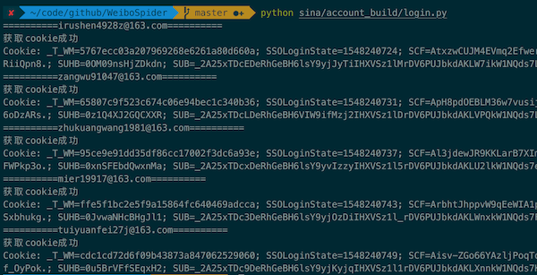
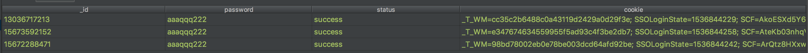
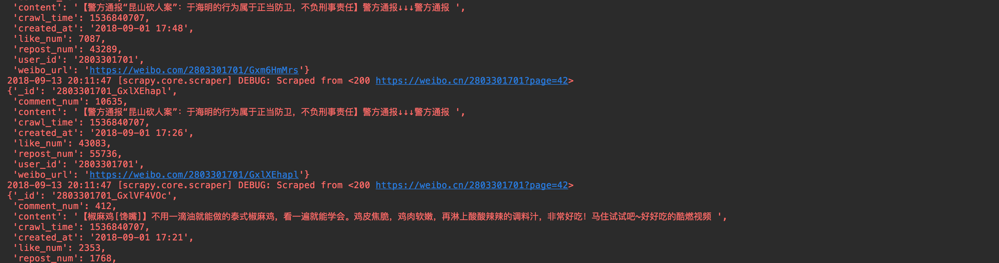

# WeiboSpider
This is a sina weibo spider built by scrapy

**这是一个持续维护的微博开源项目,有任何问题请开issue**

更多关于微博爬虫的介绍请移步:[微博爬虫总结：构建单机千万级别的微博爬虫系统](http://www.nghuyong.top/2018/09/12/spider/%E5%BE%AE%E5%8D%9A%E7%88%AC%E8%99%AB%E6%80%BB%E7%BB%93%EF%BC%9A%E6%9E%84%E5%BB%BA%E5%8D%95%E6%9C%BA%E5%8D%83%E4%B8%87%E7%BA%A7%E5%88%AB%E7%9A%84%E5%BE%AE%E5%8D%9A%E7%88%AC%E8%99%AB%E7%B3%BB%E7%BB%9F/)

## 项目说明
该项目分为3个分支，以满足不同的需要

|    分支   | 特点 | 单机每日抓取量 |
| :---: | :----: |:----: |
| [simple](https://github.com/nghuyong/WeiboSpider/tree/simple) | 单账号 | 十万级|
| [master](https://github.com/nghuyong/WeiboSpider/tree/master) | 账号池 | 百万级|
| [senior](https://github.com/nghuyong/WeiboSpider/tree/senior) | 账号池+分布式 | 千万级+ | 


该项目爬取的数据字段说明，请移步:[数据字段说明与示例](./data_stracture.md)

## 如何使用
下面是master分支，也就是构建单机百万级的爬虫

如果你只想用你自己的一个账号简单爬取微博，每日十万级即可，请移步[simple分支](https://github.com/nghuyong/WeiboSpider/tree/simple)

如果你需要大规模爬取微博，需要单机千万级别，请移步[senior分支](https://github.com/nghuyong/WeiboSpider/tree/senior)

### 克隆本项目 && 安装依赖
本项目Python版本为Python3.6
```bash
git clone git@github.com:nghuyong/WeiboSpider.git
cd WeiboSpider
pip install -r requirements.txt
```
除此之外，还需要安装mongodb和phantomjs，这个自行Google把

### 购买账号
小号购买地址(**访问需要翻墙**): http://www.xiaohao.shop/ 

购买普通国内手机号注册的小号即可


购买越多，sina/settings.py 中的延迟就可以越低，并发也就可以越大

**将购买的账号复制到`sina/account_build/account.txt`中，格式与`account_sample.txt`保持一致**。

### 构建账号池

```bash
python sina/account_build/login.py
```
运行截图:



这是你的mongodb中将多一个账号表，如下所示:



### 运行爬虫
```bash
scrapy crawl weibo_spider 
```
运行截图:



导入pycharm后，也可以直接执行`sina/spider/weibo_spider.py`

该爬虫是示例爬虫，将爬取 人民日报 和 新华视点 的 用户信息，全部微博，每条微博的评论，还有用户关系。

可以根据你的实际需求改写示例爬虫。

## 速度说明

一个页面可以抓取10则微博数据

下表是我的配置情况和速度测试结果

|    爬虫配置   | 配置值 |
| :---: | :----: |
| 账号池大小  | 200+ |
| CONCURRENT_REQUESTS | 16 |
| DOWNLOAD_DELAY | 0.1s|
| 每分钟抓取网页量 | 250+ |
| 每分钟抓取数据量 | 2500+ |
| 总体一天抓取数据量 | **360万+** |

实际速度和你自己电脑的网速/CPU/内存有很大关系。