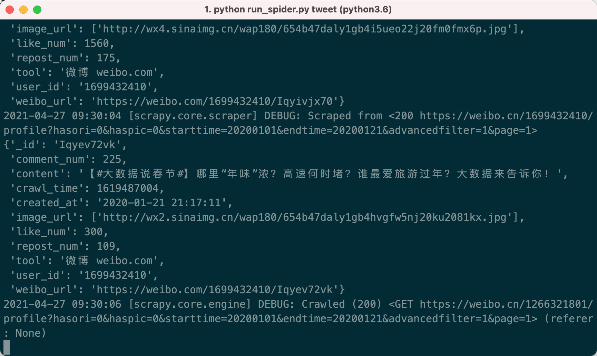
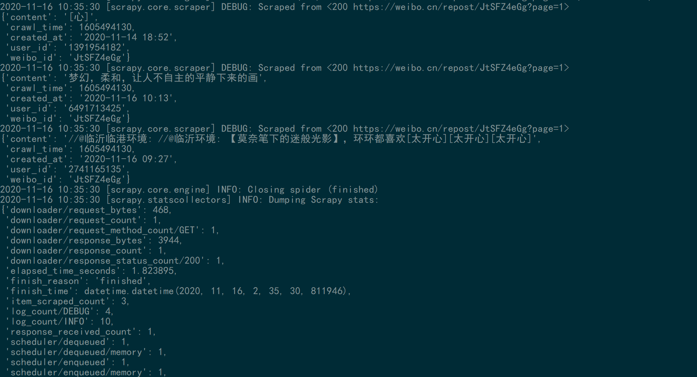

**中文说明** | [English](./README_EN.md)

# WeiboSpider
<a href="https://github.com/nghuyong/WeiboSpider/stargazers">
    
  </a>
  <a href="https://github.com/nghuyong/WeiboSpider/issues">
        
  </a>
  <a href="https://github.com/nghuyong/WeiboSpider/">
        
  </a>
  <a href="https://github.com/nghuyong/WeiboSpider/blob/master/LICENSE">
        
</a>

持续维护的新浪微博爬虫🚀🚀🚀

**UPDATE: weibo.cn的关键词搜索接口已失效（2021.6.6）**

## 项目说明

### 版本说明
该项目分为2个分支，以满足不同的需要

|分支|特点|抓取量|
|:---:|:---:|:---:|
|[master](https://github.com/nghuyong/WeiboSpider/tree/master)|单账号,单IP,单机器|十万级|
|[senior](https://github.com/nghuyong/WeiboSpider/tree/senior)|账号池,IP池,Docker分布式|数亿级(**理论无上限**)|

### 支持爬虫
- 用户信息抓取
- 用户微博抓取(全量/指定时间段)
- 用户社交关系抓取(粉丝/关注)
- 微博评论抓取
- 基于关键词和时间段(粒度到小时)的微博抓取
- 微博转发抓取

### 字段说明
项目基于weibo.cn站点抓取，抓取的字段非常丰富。具体请移步:[数据字段说明](./.github/data_stracture.md)

## 如何使用

### 拉取项目 && 安装依赖
本项目Python版本为Python3.6
```bash
git clone git@github.com:nghuyong/WeiboSpider.git --depth 1 --no-single-branch
cd WeiboSpider
pip install -r requirements.txt
```
除此之外，还需要安装mongodb.

### 替换Cookie
访问https://weibo.cn/

登陆账号，打开浏览器的开发者模式，再次刷新


复制weibo.cn这个数据包，network中的cookie值

将`weibospider/settings.py`中:
```python
DEFAULT_REQUEST_HEADERS = {
    'User-Agent': 'Mozilla/5.0 (Macintosh; Intel Mac OS X 10.13; rv:61.0) Gecko/20100101 Firefox/61.0',
    'Cookie':'SCF=AlvwCT3ltiVc36wsKpuvTV8uWF4V1tZ17ms9t-bZCAuiVJKpCsgvvmSdylNE6_4GbqwA_MWvxNgoc0Ks-qbZStc.; OUTFOX_SEARCH_USER_ID_NCOO=1258151803.428431; SUB=_2A25zjTjHDeRhGeBN6VUX9SvEzT-IHXVQjliPrDV6PUJbkdANLUvskW1NRJ24IEPNKfRaplNknl957NryzKEwBmhJ; SUHB=0ftpSdul-YZaMk; _T_WM=76982927613'
}
```
Cookie字段替换成你自己的Cookie

**如果爬虫运行出现403/302，说明账号被封/cookie失效，请重新替换cookie**

## 添加代理IP(可选)
重写[fetch_proxy](./weibospider/middlewares.py#6L)方法，该方法需要返回一个代理ip

## 运行程序

**可根据自己实际需要重写`./weibospider/spiders/*`中的`start_requests`函数**

### 抓取用户信息

```
cd weibospider
python run_spider.py user
```


### 抓取用户粉丝列表
```bash
python run_spider.py fan
```


### 抓取用户关注列表
```bash
python run_spider.py follow
```


### 抓取微博评论
```bash
python run_spider.py comment
```


### 抓取用户的微博(全量)
在`./weibospider/spiders/tweet.py`中`start_requests`,urls选择`init_url_by_user_id()`
```bash
python run_spider.py tweet
```


### 抓取用户的微博(指定时间段)
在`./weibospider/spiders/tweet.py`中`start_requests`,urls选择`init_url_by_user_id_and_date()`
```bash
python run_spider.py tweet
```


### 抓取包含关键词的微博（已失效）
在`./weibospider/spiders/tweet.py`中`start_requests`,urls选择`init_url_by_keywords_and_date()`
```bash
python run_spider.py tweet
```


### 抓取微博转发

```bash
python run_spider.py repost
```



## 写在最后
基于该项目已经构建千万级别的微博活跃用户数据集，以及海量的微博舆情数据集，现已公开[weibo-public-opinion-datasets](https://github.com/nghuyong/weibo-public-opinion-datasets)

如果您在使用该项目中有任何问题，均可以开issue进行讨论

如果您在社交媒体计算/舆情分析等领域上有好的idea，欢迎一起交流合作: nghuyong@163.com
