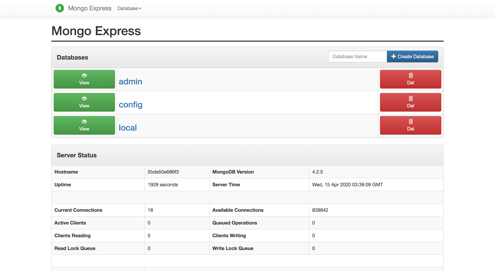
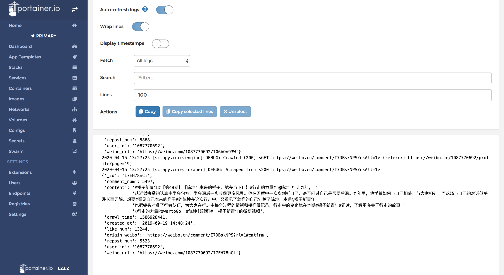
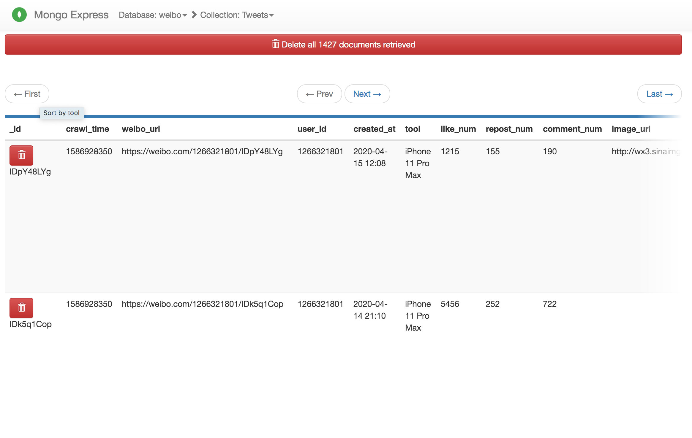

# WeiboSpider
这可能是全网最强的微博爬虫项目！[持续维护中]

## 项目说明

### 版本说明
该项目分为2个分支，以满足不同的需要

|分支|特点|抓取量|
|:---:|:---:|:---:|
|simple|单账号,单IP,单机器|十万级|
|master|账号池,IP池,Docker分布式|数亿级(**理论无上限**)|

### 支持爬虫
- 用户信息抓取
- 用户微博抓取
- 用户社交关系抓取(粉丝/关注)
- 微博评论抓取
- 基于关键词和时间段的微博抓取

### 字段说明
项目基于weibo.cn站点抓取，抓取的字段非常丰富。

具体数据字段说明,请移步:[数据字段说明](./.github/data_stracture.md)

## 如何使用

### 拉取镜像

```bash
docker pull portainer/portainer
docker pull mongo
docker pull mongo-express
docker pull redis
docker pull registry.cn-hangzhou.aliyuncs.com/weibospider/account
docker pull registry.cn-hangzhou.aliyuncs.com/weibospider/spider
```

### 启动项目
```bash
docker stack deploy -c <(docker-compose config) weibospider
```

```bash
docker service ls 
-----------------
ID                  NAME                               MODE                REPLICAS            IMAGE                                                          PORTS
f7yx1cjh1izt        weibospider_portainer              replicated          1/1                 portainer/portainer:latest                                     *:7000->9000/tcp
5szekv996su0        weibospider_mongodb                replicated          1/1                 mongo:latest                                                   *:7001->27017/tcp
lq7kmlekcrlg        weibospider_mongo-express          replicated          1/1                 mongo-express:latest                                           *:7002->8081/tcp
xjbddlf53hai        weibospider_redis                  replicated          1/1                 redis:latest                                                   *:7003->6379/tcp
mk8dmh6nl17i        weibospider_account                replicated          1/1                 registry.cn-hangzhou.aliyuncs.com/weibospider/account:latest
nvo9dt0r5v2t        weibospider_weibo-spider-comment   replicated          1/1                 registry.cn-hangzhou.aliyuncs.com/weibospider/spider:latest
vbnyacpm3xle        weibospider_weibo-spider-fan       replicated          1/1                 registry.cn-hangzhou.aliyuncs.com/weibospider/spider:latest
qyvu9wt0fzny        weibospider_weibo-spider-follow    replicated          1/1                 registry.cn-hangzhou.aliyuncs.com/weibospider/spider:latest
h3dfh8qr1eak        weibospider_weibo-spider-tweet     replicated          1/1                 registry.cn-hangzhou.aliyuncs.com/weibospider/spider:latest
jiaz176hzbls        weibospider_weibo-spider-user      replicated          1/1                 registry.cn-hangzhou.aliyuncs.com/weibospider/spider:latest
```
- portainer

访问 `http://127.0.0.1:7000`

在这里可以方便得对所有的服务进行管理，查看服务运行日志，通过`scale`可以方便的进行服务的启动，停止，扩容。

- mongo-express

访问 `http://127.0.0.1:7002`

在这里可以方便的管理，查看mongo数据库

### 构建账号池
**准备无验证码类型的微博小号**, 免验证码的微博小号购买渠道[在此讨论](https://github.com/CUHKSZ-TQL/WeiboSpider_SentimentAnalysis/issues/2#issuecomment-505842345)。

将购买的小号填充到`./weibospider/account/account.txt`，格式与`./weibospider/account/account_sample.txt`保持一致。

获取容器id，并进入容器
```bash
docker container ls | grep weibospider_account
1f15415443f8        registry.cn-hangzhou.aliyuncs.com/weibospider/account:latest   "python3"                22 minutes ago      Up 22 minutes                           weibospider_account.1.h091uc5sm0l1iz9oxpa7ypwak

docker exec -it 1f15415443f8 bash
root@1f15415443f8:/app#
```

构建账号池
```bash
root@1f15415443f8:/app# cd account
root@1f15415443f8:/app# python login.py
2020-04-15 11:56:56 ==============================
2020-04-15 11:56:56 start fetching cookie [zhanyuanben85c@163.com]
2020-04-15 11:57:04 cookie: _T_WM=0bfd51e7d3bdc1f914c5dbce3a4b20e0; SSOLoginState=1586923020; SUHB=010GS1NzSA-zOR; SCF=AmfAT-ydYBWL_ip0UMdV5KYFRwiWaFNTPoxWBgCc76c8PHXBkcp-CSNZArDRyyt1oShEm-T4Qukkw9W9n5eGrXA.; SUB=_2A25zkvZcDeRhGeFN71AY9i7FyzuIHXVRfJoUrDV6PUJbkdANLXjTkW1NQDAS-yKGeo_seRGTTKVAeOs1IG_ucher
2020-04-15 11:57:04 ==============================
2020-04-15 11:57:04 start fetching cookie [chuicong7188031104@163.com]
2020-04-15 11:57:11 cookie: _T_WM=6cf59fb4e2df7ba2b15e93d6bc184940; SSOLoginState=1586923028; SUHB=06ZV1_UTgTUirk; SCF=AvGBrUc4rNRZapeLXnQjOvrK9SyaN8dtGH_JfZamRkCRwCC6H1NJmJ6EVdZG26_lwfURJ233mRb5G-ZiM3WgGWA.; SUB=_2A25zkvZEDeRhGeFN71ET9S_Fzj6IHXVRfJoMrDV6PUJbkdANLRahkW1NQDAPyyhLB1NH_XSKtFoOQ2xwxkKWEMh5
2020-04-15 11:57:11 ==============================
2020-04-15 11:57:11 start fetching cookie [zhi21614055@163.com]
2020-04-15 11:57:19 cookie: _T_WM=6cc104aff523785aed114eb28996cb84; SSOLoginState=1586923035; SUHB=0bts1yfOjc42hI; SCF=AtAdd0uPAxdek8Hhh6JBOkxqFANmv7EqVebH6aHdY-3T_LUHoaIp6TaCo_57zCFZ-izJVcs01qs20b5cBpuwS_c.; SUB=_2A25zkvZLDeRhGeFN71AY9CjLwjuIHXVRfJoDrDV6PUJbkdANLWXjkW1NQDAJWlhRm6NkHCqHoOG9PBE1DOsaqX39
```
----
如果无法购买无验证码的小号也可以直接通过网页获取cookie，
修改[insert_cookie](./weibospider/account/db_utils.py#L33)函数的参数.

```bash
# 手工逐个添加构建
root@1f15415443f8:/app# python db_utils.py
```

### 添加代理IP
请重写[fetch_proxy](./weibospider/middlewares.py#L52)方法，该方法需要返回一个代理ip

### 初始化Redis

```bash
root@be3ac5910132:/app# python redis_init.py tweet_by_user_id
Add urls to tweet_spider:start_urls
Added: https://weibo.cn/1087770692/profile?page=1
Added: https://weibo.cn/1699432410/profile?page=1
Added: https://weibo.cn/1266321801/profile?page=1
```

参数可选项为:user,fan,follow,comment,tweet_by_user_id,tweet_by_keyword

这里可以根据自己的需求自行修改`./weibospider/redis_init.py`

### 爬虫运行
爬虫程序使用会监测redis中是否有待抓取的URL，当redis初始化完毕爬虫就会自动运行了

在mongo-express中也可以看到实时抓取的数据


## 速度说明
分布式爬虫的最终速度和账号池的大小，IP代理的质量数量，服务器的带宽，服务器的性能（IO/内存/CPU）均有关系

下面是我测试的一组速度，供参考:

|配置项|配置值|
|:---:|:---:|
|账号池大小|1000+|
|[CONCURRENT_REQUESTS](./weibospider/settings.py#15)|16|
|[DOWNLOAD_DELAY](./weibospider/settings.py#18)|0.1s|
|[DOWNLOAD_TIMEOUT](./weibospider/settings.py#21)|3|
|爬虫容器个数|100|
|服务器带宽|30M|
|服务器内存|256GB|
|服务器CPU|E5-2650 v4 @ 2.20GHz * 48|

经过测算，每个容器，每分钟网页抓取量:**300+**

一天抓取的网页为: `300(pages/(container*min)) * 100(containers) * 60*24(mins/day) = 43,200,000(pages/day)` **4.3千万网页**

如果抓取用户数据，`1(data/page)` ，

则一天的数据抓取量是 `43,200,000(pages/day) * 1(data/page) = 43,200,000(data/day)` **4.3千万数据**

如果抓取微博/评论/社交关系数据，`10(data/page)` ，

则一天的数据抓取量是 `43,200,000(pages/day) * 10(data/page) = 432,000,000(data/day)` **4.3亿数据**