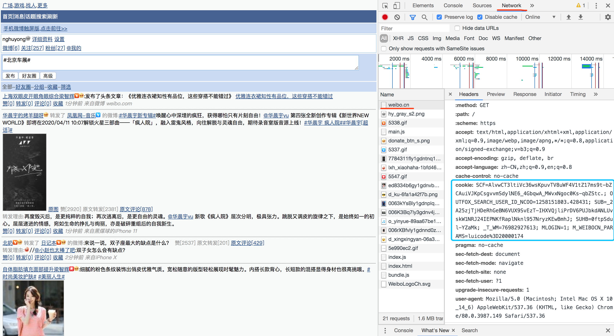
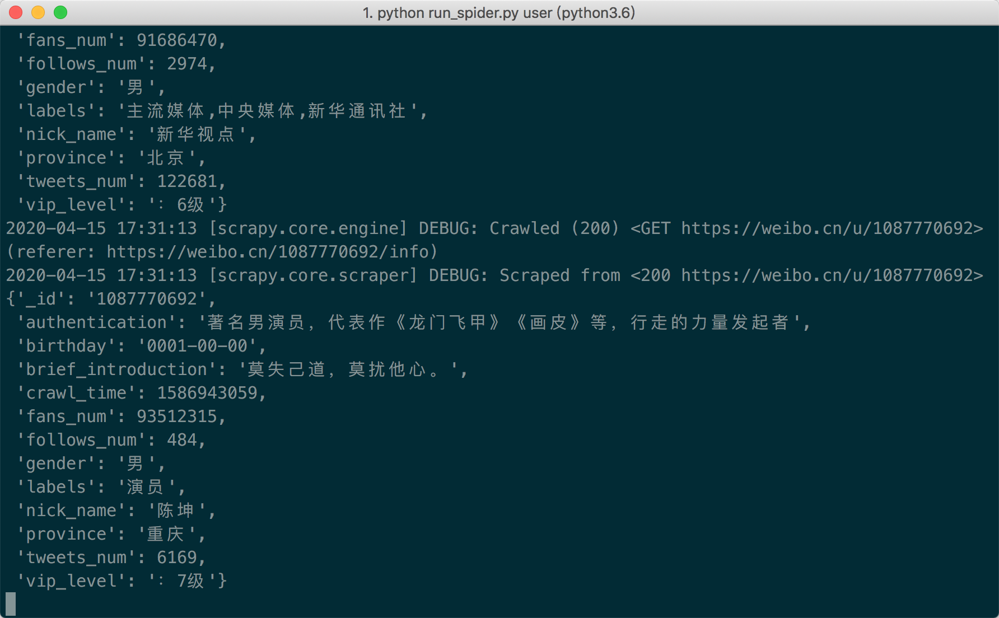
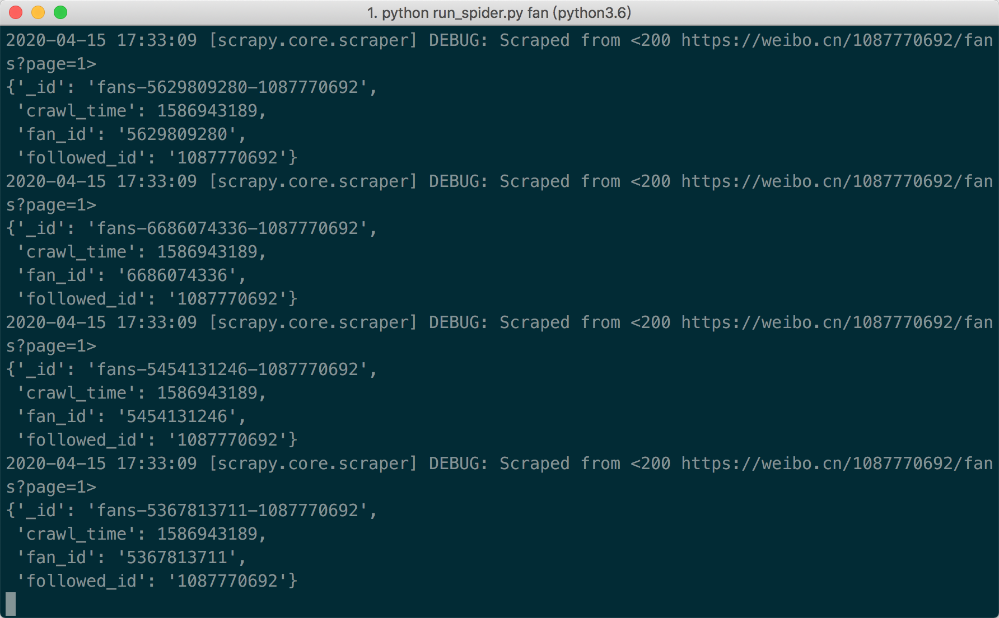
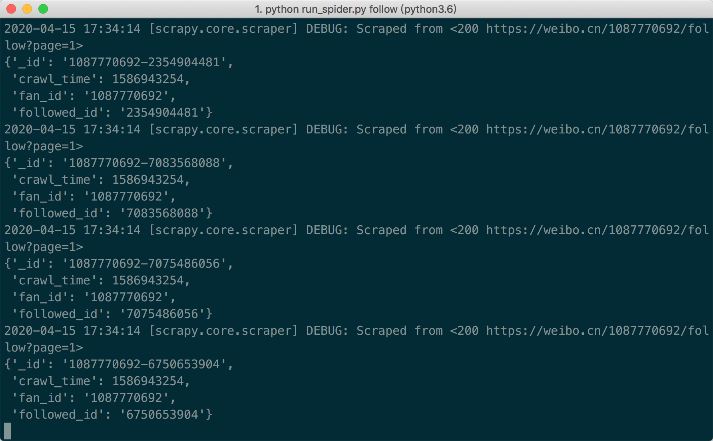
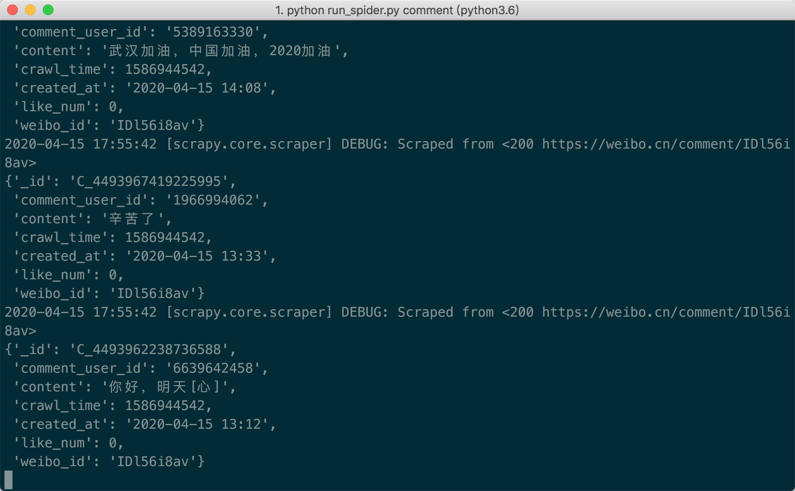
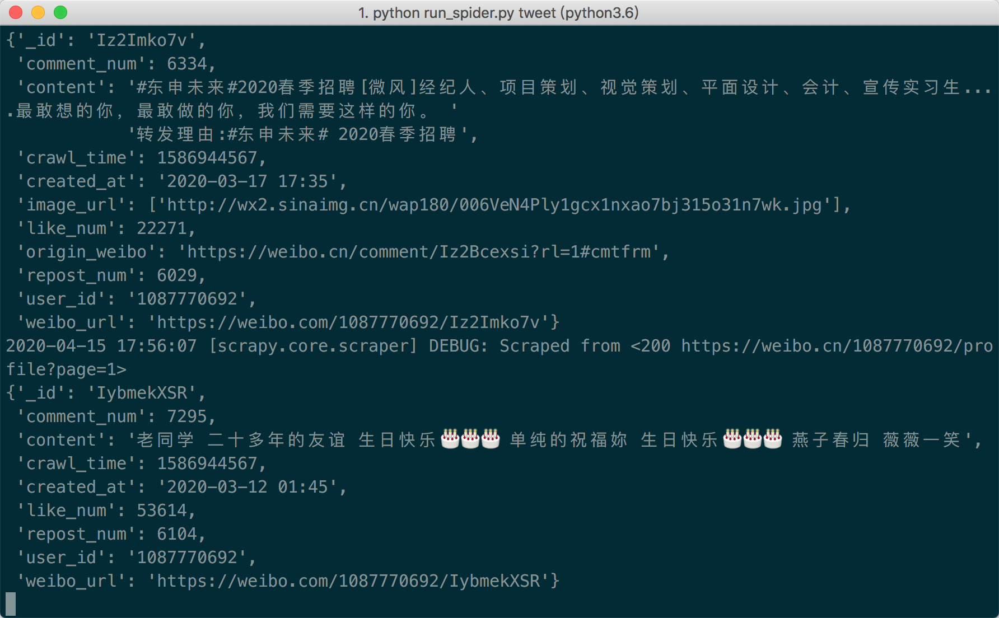
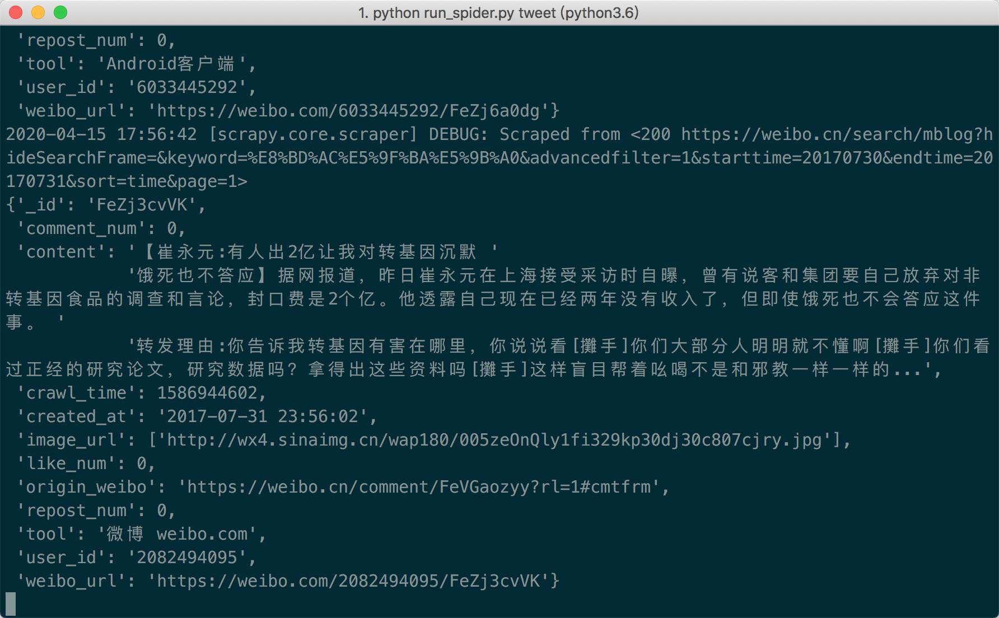

# WeiboSpider-Simple

This version is a simple version with only one weibo account and only one IP.
It can realize the daily capture of 100,000 data.

## Introduction

### Supported crawling types
- User Information
- Tweets post by user
- Users' social relationships (fans/followers)
- Comments of tweets
- Tweets based on keywords and time period

### Data Structure
The spider based on the `weibo.cn`, and the crawled fields are very rich. More detail:[Data Structure Description](./.github/data_stracture.md)

## Get Started

### Pull the project && Install dependencies
Note that the Python Version is Python3.6
```bash
git clone git@github.com:nghuyong/WeiboSpider.git --depth 1 --no-single-branch
cd WeiboSpider
git checkout simple
pip install -r requirements.txt
```
In addition, you need to install mongodb.

### Replace Cookies
Vist https://weibo.cn/

Log in, open the developer mode of the browser, and refresh again



Copy the cookie value in the network in the weibo.cn data packet.

Edit `weibospider/settings.py`中:
```python
DEFAULT_REQUEST_HEADERS = {
    'User-Agent': 'Mozilla/5.0 (Macintosh; Intel Mac OS X 10.13; rv:61.0) Gecko/20100101 Firefox/61.0',
    'Cookie':'SCF=AlvwCT3ltiVc36wsKpuvTV8uWF4V1tZ17ms9t-bZCAuiVJKpCsgvvmSdylNE6_4GbqwA_MWvxNgoc0Ks-qbZStc.; OUTFOX_SEARCH_USER_ID_NCOO=1258151803.428431; SUB=_2A25zjTjHDeRhGeBN6VUX9SvEzT-IHXVQjliPrDV6PUJbkdANLUvskW1NRJ24IEPNKfRaplNknl957NryzKEwBmhJ; SUHB=0ftpSdul-YZaMk; _T_WM=76982927613'
}
```
Replace the cookie field with your own cookie

**If 403/302 appears on the crawler, it means that the account is blocked or the cookie is invalid**

## Add proxy IP (optional)
Rewrite the function [fetch_proxy](./weibospider/middlewares.py#6L).

## Run the program

You can rewrite functions of `start_requests` in `./weibospider/spiders/*`

### Crawl User Info

```
cd weibospider
python run_spider.py user
```


### Crawl Fans List
```bash
python run_spider.py fan
```



### Crawl Followers List
```bash
python run_spider.py follow
```


### Crawl Comments of tweets
```bash
python run_spider.py comment
```


### Crawl Tweets of Users
`urls` select `init_url_by_user_id()` in the function of `start_requests` in `./weibospider/spiders/tweet.py`
```bash
python run_spider.py tweet
```


### Crawl Tweets of Specific Keywords and Time
`urls` select `init_url_by_keywords()` in the function of `start_requests` in `./weibospider/spiders/tweet.py`
```bash
python run_spider.py tweet
```
